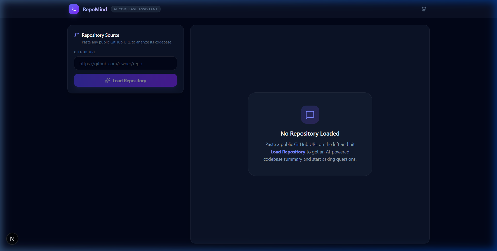
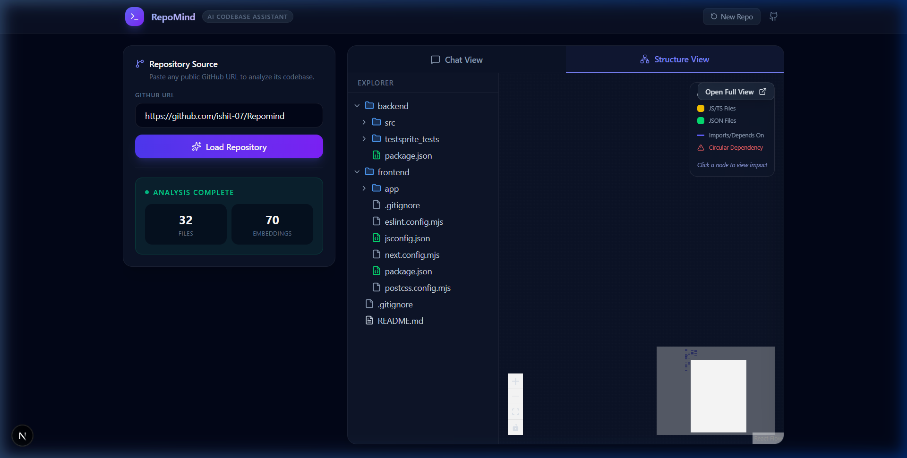
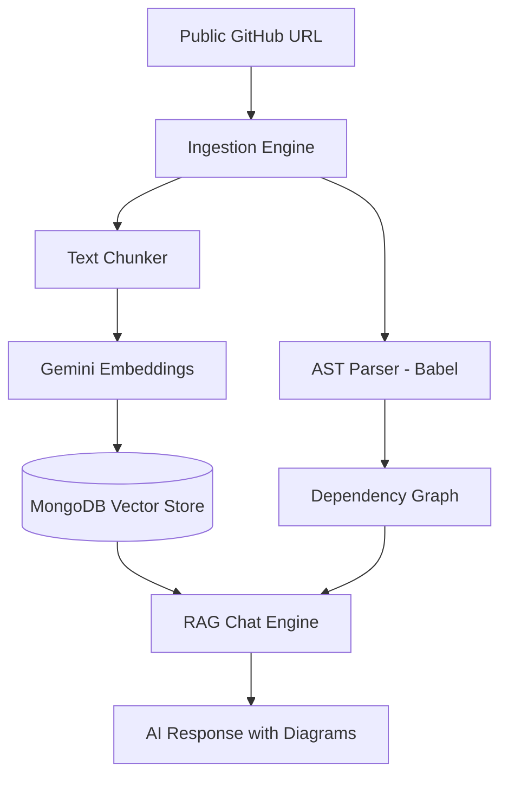

# RepoMind 🧠

**RepoMind** is an AI-powered codebase assistant that allows you to ingest any public GitHub repository and interact with it using natural language. It combines Retrieval-Augmented Generation (RAG) with AST-based code analysis to provide a deep understanding of your codebase.





## ✨ Features

- **🚀 Instant Ingestion**: Paste any public GitHub URL to analyze the entire repository.
- **💬 AI Chat**: Ask questions about the codebase, find bugs, or request explanations for complex logic.
- **📊 Structure Visualization**:
  - **Dependency Graph**: Visualize how files interact using a dynamic React Flow graph.
  - **File Tree**: Navigate the repository structure with ease.
- **🧩 Smart Suggestions**: Get AI-generated questions to help you explore the repository.
- **✨ Animated UI**: A modern, dark-themed interface built with Next.js and Tailwind CSS.
- **🛠️ AST Analysis**: Deep parsing of JavaScript/TypeScript files to build precise dependency maps.

## 🛠️ Tech Stack

### Frontend
- **Framework**: [Next.js](https://nextjs.org/) (App Router)
- **Styling**: [Tailwind CSS](https://tailwindcss.com/)
- **Icons**: [Lucide React](https://lucide.dev/)
- **Graphs**: [@xyflow/react](https://reactflow.dev/) (React Flow)
- **Markdown**: `react-markdown` with `remark-gfm`
- **Diagrams**: [Mermaid.js](https://mermaid.js.org/)

### Backend
- **Runtime**: [Node.js](https://nodejs.org/)
- **Framework**: [Express](https://expressjs.com/)
- **AI/LLM**: [Google Gemini AI](https://ai.google.dev/) (Gemini Flash for chat, Gemini Embedding for RAG)
- **Database**: [MongoDB](https://www.mongodb.com/) (using Mongoose)
- **Parser**: [Babel Parser](https://babeljs.io/docs/en/babel-parser) (for AST analysis)

---

## 🚀 Getting Started

### Prerequisites
- Node.js (v18+)
- MongoDB (Local or Atlas)
- Google Gemini API Key ([Get one here](https://aistudio.google.com/app/apikey))

### Installation

1. **Clone the repository**
   ```bash
   git clone https://github.com/ishit-07/Repomind.git
   cd Repomind
   ```

2. **Backend Setup**
   ```bash
   cd backend
   npm install
   ```
   Create a `.env` file in the `backend` directory:
   ```env
   PORT=5000
   MONGODB_URI=your_mongodb_connection_string
   GEMINI_API_KEY=your_gemini_api_key
   ```
   Start the backend:
   ```bash
   npm run dev
   ```

3. **Frontend Setup**
   ```bash
   cd ../frontend
   npm install
   ```
   Start the frontend:
   ```bash
   npm run dev
   ```

4. **Access the App**
   Open [http://localhost:3000](http://localhost:3000) in your browser.

---

## 📂 Project Structure

```text
RepoMind/
├── backend/                # Node.js Express server
│   ├── src/
│   │   ├── services/       # RAG, Gemini, GitHub & AST logic
│   │   ├── models/         # MongoDB schemas
│   │   └── server.js       # API endpoints
│   └── testsprite_tests/   # Automated tests
├── frontend/               # Next.js Application
│   ├── app/
│   │   ├── components/     # UI Components (Graphs, Tree, Chat)
│   │   └── page.js         # Main Dashboard
│   └── public/             # Static assets
└── .gitignore              # Root git settings
```

---

## 🧠 How it Works

RepoMind leverages a sophisticated pipeline to provide deep insights into your codebase:



### 1. Ingestion & AST Parsing
When a repository is loaded, RepoMind **fetches the repository content recursively using the GitHub API**. It selectively retrieves source files (filtering out ignored directories) and runs them through a **Babel-based AST parser**. This extracts:
- Function definitions and calls.
- Class hierarchies.
- Import/Export relationships (to build the dependency map).

### 2. Retrieval-Augmented Generation (RAG)
Code is broken down into semantic chunks and converted into high-dimensional vectors using **Gemini-001 Embeddings**. These are stored in MongoDB. When you ask a question:
- Your query is vectorized.
- We perform a **Cosine Similarity** search to find the 8 most relevant code snippets.
- These snippets are injected into the LLM prompt as context.

### 3. Dynamic Visualization
The **Structure View** uses `@xyflow/react` to render a force-directed graph of your project's internal dependencies, allowing you to "see" the architecture instead of just reading it.

---

## 🛰️ API Endpoints

- `POST /api/ingest`: Start the repository analysis pipeline.
- `POST /api/chat`: Multi-turn streaming chat with RAG context.
- `GET /api/structure`: Retrieve the parsed AST dependency map and file tree.
- `GET /api/suggestions`: Get AI-generated exploration prompts.

---

## 🤝 Contributing

Contributions are welcome! Whether it's adding support for new languages, improving the RAG precision, or enhancing the UI/UX.

1. Fork the Project
2. Create your Feature Branch (`git checkout -b feature/AmazingFeature`)
3. Commit your Changes (`git commit -m 'Add some AmazingFeature'`)
4. Push to the Branch (`git push origin feature/AmazingFeature`)
5. Open a Pull Request

---

## 📈 Roadmap

- [ ] Support for Python and Go (AST parsing).
- [ ] Local codebase indexing (CLI tool).
- [ ] Integration with private repositories (OAuth).
- [ ] Exportable architecture reports (PDF/Markdown).

